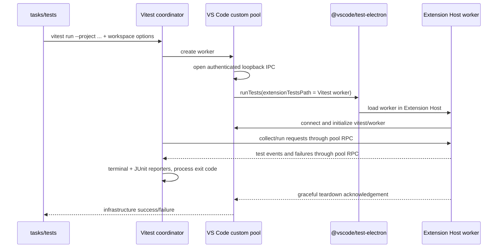

# Jest to Vitest migration plan

## Recommendation

Migrate in two tracks:

1. Move the non-VS Code-hosted tests to Vitest first while retaining Jest for extension-host integration tests.
2. Gate the integration migration on a small custom-pool prototype. Keep the Vitest coordinator, reporters, and exit status in the normal Node process, and use the VS Code Extension Host as a remote Vitest worker.

Do not make the production migration depend on `vitest-environment-vscode` as-is. It is a useful reference implementation, but it is new, uses a low-level experimental Vitest API, and currently contains code that does not match this repository's `@vscode/test-electron` API. Implement the repository-specific pool in-tree using only public Vitest 4 APIs.

If the prototype cannot run through public APIs on the full CI matrix, stop after the unit-test migration and retain Jest for integration tests.

Do not gate the entire Vitest migration on converting the repository to ESM. Vitest can run the non-extension-host projects without changing the extension's module format, and a repository-wide ESM conversion would affect the extension runtime, task scripts, build tooling, and packaging well beyond the test migration. Instead, gate the integration track on proving a narrow module boundary: the CommonJS `extensionTestsPath` entry point must be able to bootstrap a separately built ESM Vitest worker using Node's native dynamic import. If that boundary proves unreliable or requires runtime hacks, make a repository-wide ESM migration a prerequisite for Phases 2 and 3.

## Current-state findings

- The root Jest configuration defines nine projects:
  - Five non-extension-host projects: LSP unit, OmniSharp unit, Razor unit, task unit, and artifact tests.
  - Four extension-host projects: LSP, OmniSharp, Razor, and untrusted-workspace integration tests.
- There are 101 test files: 49 non-extension-host and 52 extension-host integration files.
- Jest coupling in test code is mostly mechanical:
  - 146 TypeScript test/helper files import `@jest/globals`.
  - 12 `jest.spyOn`, 6 `jest.fn`, 5 `jest.mock`, 2 `jest.replaceProperty`, and 2 `jest.requireActual` calls.
  - One snapshot assertion.
  - One `MockedFunction` import from `jest-mock`.
- The integration runner is deeply Jest-specific:
  1. `tasks/tests/testHelpers.ts` chooses a workspace/test asset, sets the JUnit filename, and calls `test/vscodeLauncher.ts`.
  2. `test/vscodeLauncher.ts` installs dependent extensions, builds special test workspaces, and invokes `@vscode/test-electron.runTests`.
  3. VS Code loads a compiled per-suite `index.js` through `extensionTestsPath`.
  4. That entry point calls `test/runIntegrationTests.ts`, which embeds Jest with `jest.runCLI({ runInBand: true })`.
  5. `test/vsCodeEnvironment.ts` and `test/vsCodeFramework.ts` inject the real Extension Host `vscode` module into Jest.
  6. The in-host runner calls `process.exit` and the parent receives only the VS Code process exit code.
- CI already uses Node.js 24 and publishes `out/*junit.xml`, so Vitest 4's Node requirement and built-in JUnit reporter fit the existing pipeline.
- Developer tooling also contains Jest-specific settings in `.vscode/settings.json`, `.vscode/extensions.json`, and `.devcontainer/devcontainer.json`.

## Target architecture

The important inversion is that the Extension Host is a Vitest pool worker, not a nested, independent Vitest CLI. Test events flow back over Vitest's worker protocol, so the outer Vitest process owns reporting and pass/fail status. `@vscode/test-electron` exit status is reserved for host launch/crash/teardown failures.

Use Vitest 4.1.x initially and pin the exact version during the migration. Vitest 5 is still beta as of this investigation. Vitest 4.1.10 publicly exports `PoolRunnerInitializer`, `PoolWorker`, `init`, `runBaseTests`, and `setupEnvironment`, so the worker should not import generated chunks or other private Vitest internals.

## Phase 0: Prove the Extension Host worker

Create a temporary, explicitly named integration-spike command without disturbing existing Jest commands.

1. Add a minimal Vitest configuration with one integration project targeting `untrustedWorkspace.integration.test.ts`.
2. Add an in-tree custom `PoolWorker`:
   - Bind an IPC server to loopback only.
   - Generate a per-run authentication token and pass it through `extensionTestsEnv`.
   - Reuse the launch preparation in `test/vscodeLauncher.ts`, including extension installation, workspace selection, Linux launch flags, source-generator builds, and isolated user-data directories.
   - Start with one worker, no file parallelism, and no worker reuse.
3. Add a minimal Extension Host entry module that:
   - Is loadable through `extensionTestsPath`.
   - Connects to the pool.
   - Calls public APIs from `vitest/worker`: `init`, `runBaseTests`, and `setupEnvironment`.
   - Flushes result messages before requesting VS Code shutdown.
4. Resolve the CommonJS/ESM boundary deliberately:
   - Keep the VS Code-compatible `extensionTestsPath` entry point as a minimal CommonJS loader.
   - Build the actual Vitest worker as ESM and load it through Node's native `import()`.
   - Use a dedicated test-infrastructure build/tsconfig rather than changing the extension's module format during the spike.
   - Do not add a `Function`/`eval`-based dynamic-import workaround.
   - If this cannot be implemented cleanly and portably, stop the integration migration and require a separate repository-wide ESM migration before continuing with Phases 2 and 3.
5. Make the outer Vitest process produce `out/Untrusted_Integration_spike_junit.xml` through the built-in JUnit reporter.

**Prototype acceptance gates**

- A passing test returns exit code 0 from the outer process.
- An intentional assertion failure returns exit code 1 and appears in terminal and JUnit output.
- A worker startup failure, lost IPC connection, VS Code crash, and timeout each fail the run rather than hanging or looking successful.
- The test imports and uses the real `vscode` API.
- Teardown leaves no VS Code process, IPC listener, or temporary user-data directory behind.
- The spike passes on the existing Windows, Linux, and macOS CI images with stable and Insiders VS Code.
- The implementation uses only public Vitest exports.
- The CommonJS loader/ESM worker boundary works without private loaders, generated-chunk imports, or `eval`-style workarounds.

If any gate fails because stable Vitest lacks a usable public hook, document the blocker and keep Jest for all extension-host tests.

## Phase 1: Migrate non-extension-host tests

This phase can proceed independently after the spike establishes the long-term direction.

1. Add a root `vitest.config.ts` using named Vitest projects that preserve the current project boundaries and names.
2. Configure the five non-host projects with the normal Node pool and explicit `include` patterns.
3. Replace Jest's automatic `__mocks__/vscode.ts` discovery with an explicit unit-project alias or setup module for `vscode`, while continuing to reuse `getFakeVsCode()`.
4. Convert test code:
   - `@jest/globals` imports to `vitest`.
   - `jest` helpers to `vi`.
   - `jest.requireActual` mock factories to async `vi.importActual` factories.
   - `jest.replaceProperty` calls to explicit property spies/stubs with cleanup.
   - `jest-mock` types to Vitest equivalents.
   - Validate the single Razor snapshot without bulk-updating snapshots.
5. Replace `runJestTest` with a Vitest invocation that selects named projects. Prefer the CLI through the existing task wrapper over Vitest's advanced programmatic API.
6. Preserve existing npm command contracts (`test`, `test:unit`, `test:artifacts`, and `omnisharptest:unit`) and preserve unique `out/*junit.xml` names.
7. Keep the four integration Jest projects and dependencies intact until their suites move.

**Acceptance gates**

- The same 49 non-host test files are collected.
- Existing tests pass without changing production behavior.
- A deliberately failing test proves nonzero exit status and JUnit publication.
- Snapshot output is unchanged or any difference is reviewed manually.
- Unit-test startup and runtime are recorded for before/after comparison.

## Phase 2: Productionize the custom pool

Replace the spike with repository-owned infrastructure.

1. Add focused modules for:
   - Pool configuration and lifecycle.
   - Authenticated message transport and serialization.
   - The Extension Host worker entry point.
   - Teardown/error propagation.
2. Refactor `test/vscodeLauncher.ts` so its preparation logic can be called by the custom pool without duplicating:
   - VS Code resolution/download.
   - Extension installation and retries.
   - Workspace build preparation.
   - Launch arguments and environment.
   - Log collection.
3. Pass the current per-run inputs from `tasks/tests/testHelpers.ts` into Vitest/pool configuration:
   - Workspace and test asset.
   - Suite/log name.
   - OmniSharp engine and suite variables.
   - Dev Kit enablement.
   - Optional single-file filter.
   - VS Code version and existing environment overrides.
4. Preserve current execution semantics:
   - `maxWorkers: 1` and no file parallelism.
   - 120-second test timeout.
   - One Extension Host reused across files in a normal suite.
   - A fresh host per Dev Kit test file, matching today's isolation.
5. Define an explicit shutdown protocol:
   - Vitest sends teardown.
   - The worker acknowledges after result transport is flushed.
   - The Extension Host exits successfully.
   - Pool shutdown treats premature/nonzero host exit as infrastructure failure.
6. Keep JUnit generation in the outer Vitest process and match the current Azure-friendly title/classname templates and `out/*junit.xml` filenames.
7. Add focused tests for transport authentication, disconnects, timeout handling, worker startup errors, exit-code mapping, and cleanup.

Do not introduce integration-test parallelism during the migration. It can be evaluated later after parity and stability are established.

## Phase 3: Migrate extension-host suites incrementally

Move one complete Jest project at a time so Jest and Vitest can coexist during review.

1. **Untrusted workspace** - smallest suite and already proven by the spike.
2. **C# / LSP integration** - exercises the main Roslyn path and existing workspace setup.
3. **Razor integration** - validates another extension-host project with a smaller surface.
4. **OmniSharp integration** - validates both stdio and LSP engine matrices.
5. **C# Dev Kit per-file runs** - last because each file intentionally launches an isolated VS Code instance and the task continues after individual file failures.

For each suite:

- Convert `@jest/globals` imports and any Jest helpers.
- Add/select the matching Vitest project and custom-pool options.
- Change its task entry point to invoke Vitest while preserving npm script names.
- Compare collected file/test counts with Jest.
- Exercise pass, assertion failure, timeout, host crash, logs, JUnit, stable VS Code, and Insiders VS Code.
- Run the suite on Windows, Linux, and macOS before deleting that suite's Jest configuration.

## Phase 4: Remove Jest and finish CI/tooling cleanup

After all nine projects run through Vitest:

1. Remove:
   - `jest`, `@jest/globals`, `ts-jest`, and `jest-junit`.
   - Root and per-project `jest.config.ts` files and `baseJestConfig.ts`.
   - `test/runIntegrationTests.ts`, `test/vsCodeEnvironment.ts`, and `test/vsCodeFramework.ts`.
   - Jest-specific task helpers, environment variable names, and imports.
2. Update `tsconfig.json` includes for the Vitest configuration and new worker modules.
3. Keep pipeline commands and `PublishTestResults@2` globs unchanged where possible by retaining npm script names and `*junit.xml` output.
4. Replace the Jest editor recommendation/settings with the chosen Vitest extension support, and remove `jest.runMode` and `jest.jestCommandLine`.
5. Update direct testing documentation if it references Jest commands or debugging.
6. Regenerate `package-lock.json` and verify no Jest packages remain transitively unless required by another dependency.

## Principal risks and mitigations

| Risk | Mitigation |
| --- | --- |
| Vitest's custom pool API is explicitly experimental | Pin Vitest exactly, isolate all low-level usage behind a small adapter, test the adapter, and upgrade deliberately. |
| CommonJS repo versus ESM Vitest worker | Make module loading a Phase 0 gate and use a dedicated loader/build rather than runtime hacks. |
| Extension Host hangs or result loss during teardown | Use an acknowledged shutdown protocol, bounded timeouts, disconnect handling, and parent-owned cleanup. |
| Real `vscode` module is unavailable outside the host | Execute test modules in the custom Extension Host worker and externalize `vscode` from transforms/bundles. |
| Existing launch behavior is accidentally lost | Refactor and reuse `vscodeLauncher.ts`; do not reimplement extension install, workspace build, launch args, or log copying separately. |
| Dev Kit isolation regresses | Preserve the current outer per-file loop and start a fresh Vitest invocation/host per file. |
| JUnit results change shape or overwrite each other | Keep unique per-run filenames and configure Vitest's built-in JUnit title/classname templates to match current Azure DevOps behavior. |
| The only public example is immature | Use it only as architectural evidence; build on documented Vitest 4 APIs and this repository's established launcher. |

## Reference material

- Vitest custom pools (experimental): https://vitest.dev/guide/advanced/pool
- Vitest test projects: https://vitest.dev/guide/projects
- Vitest reporters and JUnit: https://vitest.dev/guide/reporters
- Vitest 4.1.10 worker exports: https://unpkg.com/vitest@4.1.10/dist/worker.js
- VS Code Vitest pool reference implementation: https://github.com/andrew-w-ross/vitest-enviroment-vscode
- Official VS Code test CLI remains Mocha-only: https://github.com/microsoft/vscode-test-cli
